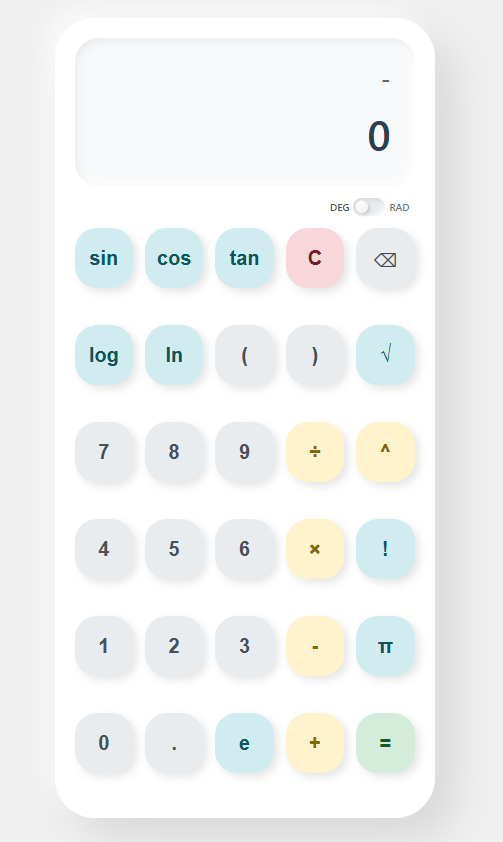

# 🧮 Scientific Calculator

A sleek and powerful **Scientific Calculator** built with JavaScript. Designed for speed, accuracy, and ease of use—perfect for students, developers, and everyday calculations.

---

## ✨ Features

- 🔢 Basic arithmetic (+, −, ×, ÷)
- 📐 Trigonometric functions (sin, cos, tan)
- 📊 Logarithmic functions (log, ln)
- 🧠 Advanced operations (power, factorial, square root)
- 🔣 Constants (π, e)
- 🔄 Degree / Radian mode toggle
- ⌨️ Keyboard input support
- 🧩 Auto-fix expressions (brackets & multiplication)
- ⚡ Real-time display updates
- ❌ Error handling for invalid inputs

---

## 🖥️ Live Demo

<p align="center">
  <a href="https://dex-calculator.netlify.app" target="_blank">
    
  </a>
</p>

**Try it live:** [dex-calculator.netlify.app](https://dex-calculator.netlify.app)

---

## 🚀 Getting Started

### 1. Clone the repository
```bash
git clone https://github.com/your-username/scientific-calculator.git
```

### 2. Open project
```bash
cd scientific-calculator
```

### 3. Run
Just open `index.html` in your browser 🚀

---

## 📂 Project Structure

```
scientific-calculator/
│── index.html
│── style.css
│── script.js
└── README.md
```

---

## 🧠 How It Works

- Builds expressions dynamically from button/keyboard input
- Automatically fixes:
  - Missing brackets
  - Implicit multiplication (e.g. `5π → 5×π`)
- Converts:
  - π → Math.PI
  - e → Math.E
- Processes trig functions based on mode (DEG/RAD)
- Evaluates expressions safely using JavaScript
- Formats results for clean output

---

## 🎮 Controls

| Action        | Input                  |
|--------------|----------------------|
| Numbers      | 0–9                  |
| Operators    | + − × ÷ ^            |
| Clear        | C / Esc              |
| Backspace    | ⌫ / Backspace        |
| Calculate    | = / Enter            |
| Constants    | π (p), e             |

---

## ⚙️ Technologies Used

- HTML5
- CSS3
- JavaScript (Vanilla JS)

---

## 💡 Example Expressions

```
sin(30)
log(100)
5!
2^3 + √(16)
3π + 2e
```

---

## 📌 Notes

- Supports both **Degree** and **Radian** modes
- Handles invalid inputs gracefully
- Results are rounded for better readability

---

## 🤝 Contributing

Contributions are welcome!

1. Fork the repo
2. Create your feature branch
3. Commit your changes
4. Open a Pull Request

---

## 📄 License

This project is open-source and available under the **MIT License**.

---

## ⭐ Support

If you like this project, give it a ⭐ on GitHub!
Check out the live version: [dex-calculator.netlify.app](https://dex-calculator.netlify.app)  

---